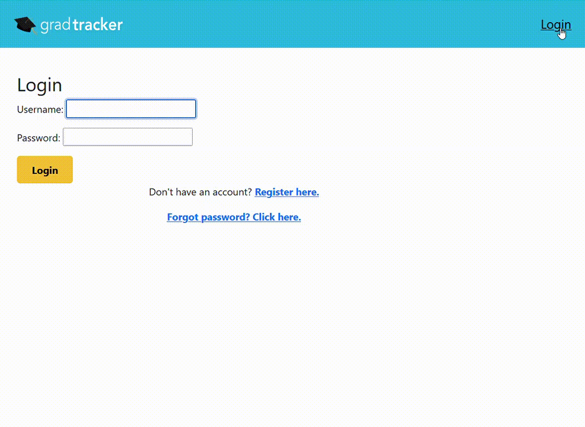
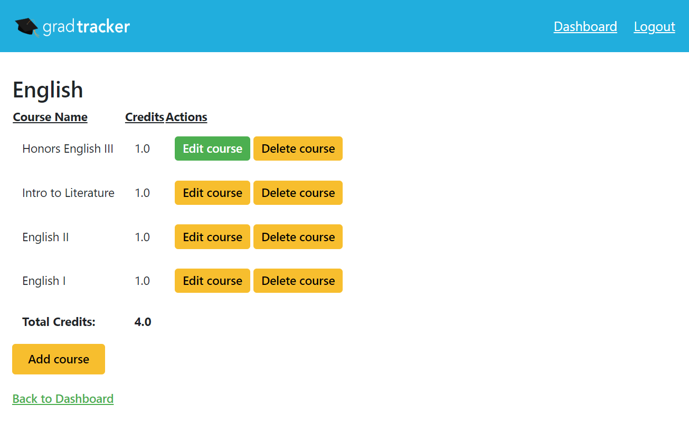

# GradTracker - High School Edition 

This project is a web application that allows high school students to keep track of their credits and visually see their progress towards graduation.

## FAQ

#### What tools are used?

Django

PostgreSQL

#### Where is the app hosted?

To be announced

## Features/Screenshots
- Homepage

- Dashboard with Chart.js 

- Register/Login Function

- Add/Delete Course

